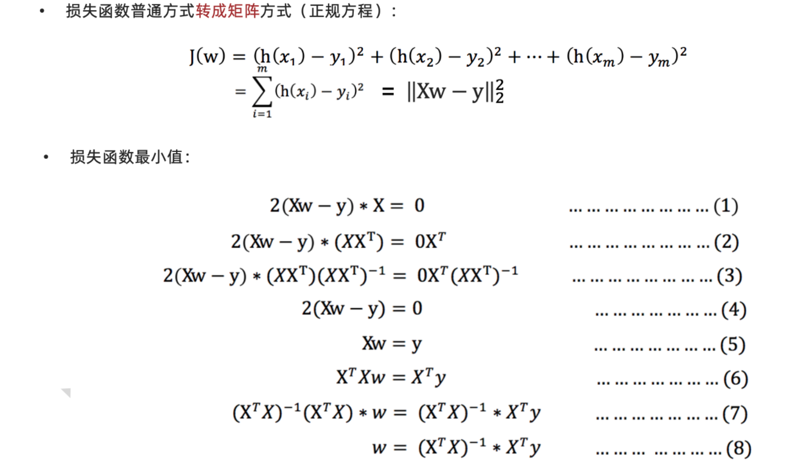
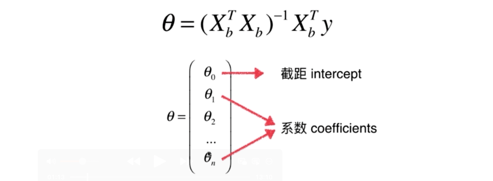

## 线性回归

线性回归(Linear regression)是利用 回归方程(函数) 对 一个或多个自变量(特征值)和因变量(目标值)之间 关系进行建模的一种分析方式。

- 只能解决回归问题
- 其他非线性模型的基础
- 结果具有很好的可解释性
- 蕴含机器学习中的很多重要思想
- 典型的参数学习


一元线性回归
- y = kx +b, 目标值只与一个因变量有关系

多元线性回归
- y(w) = w1x1 + w2x2 + w3x3 + … + wnxn + b


### 简单线性回归

假设我们找到了最佳拟合的直线方程

y=ax+b

则对于每一个样本点x(i) , x的第i个特征

根据我们的直线方程，预测值为: ^y(i) = a*x(i)+b

表达式 ^y(i) 和 y(i) 的差距： (^y(i) - y(i))^2

目标：找到 a和 b 使得 所有 (y(i) - a*x(i)- b)^2 的和最小 （损失值）


**损失值也叫损失函数、效用函数**。 

通过分析问题，确定问题的损失函数或者效用函数

通过最优化损失函数或效用函数，获得机器学习的模型

### 衡量线性回归法的指标

损失函数

#### 最小二乘法： 误差平方和


#### 均方误差(MSE,mean-square error)


#### 均方根误差（RMSE)

MSE^1/2  ,上面的开根号

#### 平均绝对误差值（mean absolute error,MAE)


#### 最小二乘法
最小二乘法: 公式（过程暂时忽略)


### 向量化运算

### 最好的衡量线性回归法的指标 R squared


### 多元线性回归

正规方程法 时间复杂度较高 o=(n^3) ,行数、列数太多，都不合适。 


#### 正规方程法

以下是公式推导过程：

设定 theta0=就是截距 


矩阵的乘法公式： 就是 xT . x    =x1^2+x2^2+...xm^2， 就是下面公式就是 l2范数的平方 (其中x是长度m的向量)





实现过程
```python
import numpy as np
from .metrics import r2_score


class LinearRegression:

    def __init__(self):
        """初始化Linear Regression模型"""
        #  系数
        self.coef_ = None
        # 截距
        self.intercept_ = None
        # ^y = Xb * _theta   都是向量运算
        self._theta = None


    def fit_normal(self, X_train, y_train):
        """根据训练数据集X_train, y_train训练Linear Regression模型"""
        assert X_train.shape[0] == y_train.shape[0], \
            "the size of X_train must be equal to the size of y_train"
        # 填充 为值 1 的  ,行数为len(X_train)的，一列 的向量
        X_b = np.hstack([np.ones((len(X_train), 1)), X_train])
        #np.linalg.inv求逆， 就是图片中的shu'xue'fu'hao
        self._theta = np.linalg.inv(X_b.T.dot(X_b)).dot(X_b.T).dot(y_train)
        # 截距
        self.intercept_ = self._theta[0]
        # 系数
        self.coef_ = self._theta[1:]

        return self

    def predict(self, X_predict):
        """给定待预测数据集X_predict，返回表示X_predict的结果向量"""
        assert self.intercept_ is not None and self.coef_ is not None, \
            "must fit before predict!"
        assert X_predict.shape[1] == len(self.coef_), \
            "the feature number of X_predict must be equal to X_train"
        # 给 x 追加 截距
        X_b = np.hstack([np.ones((len(X_predict), 1)), X_predict])
        # ^y = Xb * _theta   都是向量运算
        return X_b.dot(self._theta)

    def score(self, X_test, y_test):
        """根据测试数据集 X_test 和 y_test 确定当前模型的准确度"""

        y_predict = self.predict(X_test)
        return r2_score(y_test, y_predict)

    def __repr__(self):
        return "LinearRegression()"

```


### 对于theta 因子的思考

大于０ 表示 正相关， 小于０表示负相关。 

如房价，利于房价的特征（因素), 不利于的房价的特征

## 欠拟合与过拟合

过拟合：一个假设 **在训练数据上能够获得比其他假设更好的拟合， 但是在测试数据集上却不能很好地拟合数据** (体现在准确率下降)，此时认为这个假设出现了过拟合的现象。(模型过于复杂)

欠拟合：一个假设 **在训练数据上不能获得更好的拟合，并且在测试数据集上也不能很好地拟合数据** ，此时认为这个假设出现了欠拟合的现象。(模型过于简单)

解决方案：L1正则化、L2正则化

### 欠拟合
**欠拟合产生原因：** 学习到数据的特征过少

解决办法：

- 添加其他特征项，有时出现欠拟合是因为特征项不够导致的，可以添加其他特征项来解决

- 添加多项式特征，模型过于简单时的常用套路，例如将线性模型通过添加二次项或三次项使模型泛化能力更强

### 过拟合

**过拟合产生原因：** 原始特征过多，存在一些嘈杂特征， 模型过于复杂是因为模型尝试去兼顾所有测试样本

解决办法：

- 重新清洗数据，导致过拟合的一个原因有可能是数据不纯，如果出现了过拟合就需要重新清洗数据。

- 增大数据的训练量，还有一个原因就是我们用于训练的数据量太小导致的，训练数据占总数据的比例过小。

- 正则化

- 减少特征维度


### 正则化

在解决回归过拟合中，我们选择正则化。但是对于其他机器学习算法如分类算法来说也会出现这样的问题，除了一些算法本身作用之外（决策树、神经网络），我们更多的也是去自己做特征选择，包括之前说的删除、合并一些特征


**在学习的时候，数据提供的特征有些影响模型复杂度或者这个特征的数据点异常较多，所以算法在学习的时候尽量减少这个特征的影响（甚至删除某个特征的影响），这就是正则化**

注：调整时候，算法并不知道某个特征影响，而是去调整参数得出优化的结


**L1正则化**


在损失函数中添加L1正则化项

alpha：  代表惩罚系数（正则化系数) ， 后面是 n个参数ｗ的  L1范数。也是个超参数。 越大惩罚越大。


使用L1正则化线性回归模型 就是 LASSO回归

```python
from sklearn.linear_model import Lasso
```

**L2正则化**


使用L2正则化线性回归模型 就是 Ridge回归

```python
from sklearn.linear_model import Ridge
```

