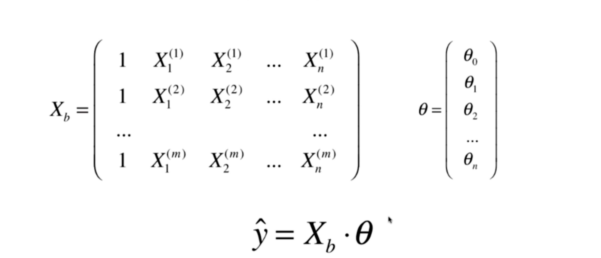

## 线性回归

线性回归(Linear regression)是利用 回归方程(函数) 对 一个或多个自变量(特征值)和因变量(目标值)之间 关系进行建模的一种分析方式。


- 只能解决回归问题
- 其他非线性模型的基础
- 结果具有很好的可解释性
- 蕴含机器学习中的很多重要思想
- 典型的参数学习


一元线性回归
- y = kx +b, 目标值只与一个因变量有关系

多元线性回归
- y(w) = w1x1 + w2x2 + w3x3 + … + wnxn + b


### 简单线性回归

假设我们找到了最佳拟合的直线方程

y=ax+b

则对于每一个样本点x(i) , x的第i个特征

根据我们的直线方程，预测值为: ^y(i) = a*x(i)+b

表达式 ^y(i) 和 y(i) 的差距： (^y(i) - y(i))^2

目标：找到 a和 b 使得 所有 (y(i) - a*x(i)- b)^2 的和最小 （损失值）


**损失值也叫损失函数、效用函数**。 

通过分析问题，确定问题的损失函数或者效用函数

通过最优化损失函数或效用函数，获得机器学习的模型

### 衡量线性回归法的指标

损失函数


#### 最小二乘法
最小二乘法: 推导出来的公司，不用管过程


### 向量化运算


### 最好的衡量线性回归法的指标 R squared


### 多元线性回归

正规方程法 时间复杂度较高 o=(n^3) ,行数、列数太多，都不合适。 


#### 正规方程法

以下是公式推导过程：

l2范数的平方





用矩阵 ，矩阵的乘法 就是 xT *x  (x是长度m的向量)  = x1^2+x2^2+...xm^2

就是下图的 w 公式


实现过程
```python
import numpy as np
from .metrics import r2_score


class LinearRegression:

    def __init__(self):
        """初始化Linear Regression模型"""
        #  系数
        self.coef_ = None
        # 截距
        self.intercept_ = None
        # ^y = Xb * _theta   都是向量运算
        self._theta = None


    def fit_normal(self, X_train, y_train):
        """根据训练数据集X_train, y_train训练Linear Regression模型"""
        assert X_train.shape[0] == y_train.shape[0], \
            "the size of X_train must be equal to the size of y_train"
        # 填充 为值 1 的  ,行数为len(X_train)的，一列 的向量
        X_b = np.hstack([np.ones((len(X_train), 1)), X_train])
        #np.linalg.inv求逆， 就是图片中的shu'xue'fu'hao
        self._theta = np.linalg.inv(X_b.T.dot(X_b)).dot(X_b.T).dot(y_train)
        # 截距
        self.intercept_ = self._theta[0]
        # 系数
        self.coef_ = self._theta[1:]

        return self

    def predict(self, X_predict):
        """给定待预测数据集X_predict，返回表示X_predict的结果向量"""
        assert self.intercept_ is not None and self.coef_ is not None, \
            "must fit before predict!"
        assert X_predict.shape[1] == len(self.coef_), \
            "the feature number of X_predict must be equal to X_train"
        # 给 x 追加 截距
        X_b = np.hstack([np.ones((len(X_predict), 1)), X_predict])
        # ^y = Xb * _theta   都是向量运算
        return X_b.dot(self._theta)

    def score(self, X_test, y_test):
        """根据测试数据集 X_test 和 y_test 确定当前模型的准确度"""

        y_predict = self.predict(X_test)
        return r2_score(y_test, y_predict)

    def __repr__(self):
        return "LinearRegression()"

```


### 对于theta 因子的思考

大于０ 表示 正相关， 小于０表示负相关。 

如房价，利于房价的特征（因素), 不利于的房价的特征
