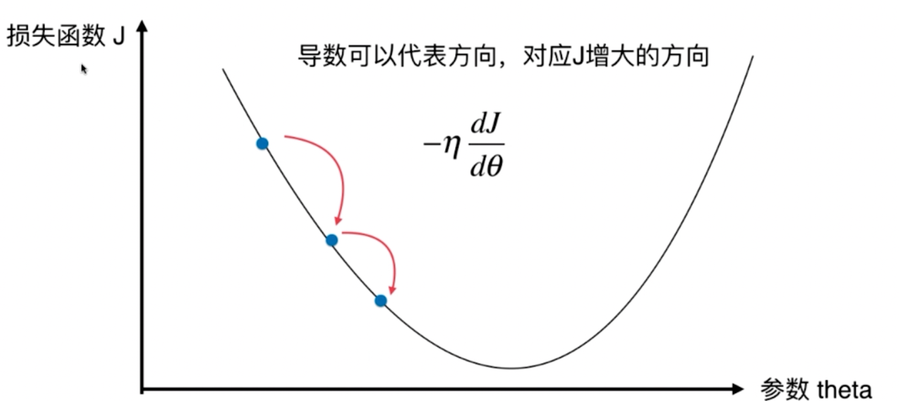
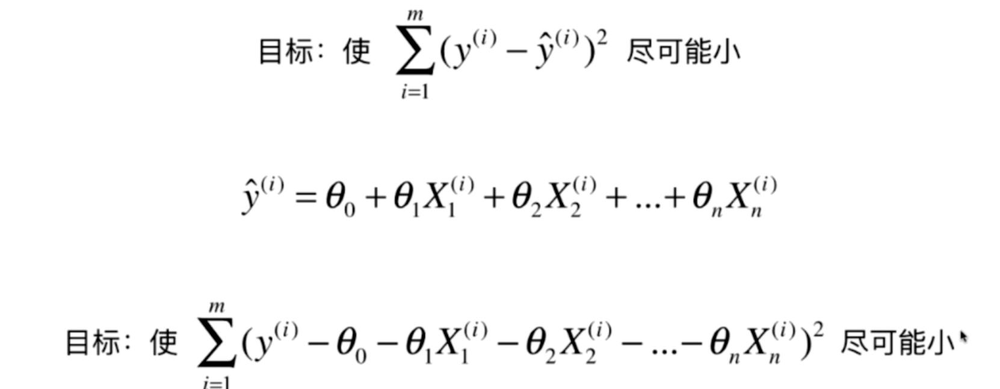
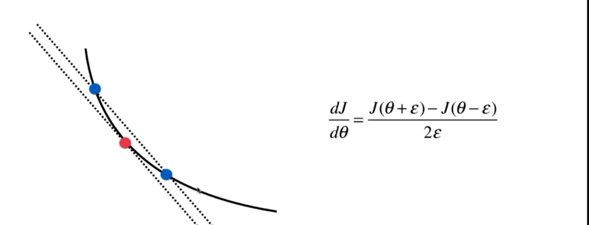

## 梯度下降法

梯度下降法是一种基于搜索的最优化方法，**作用：最小化一个损失函数**。

梯度上升法： 最大化一个效用函数。



**上图在抛物线的底端的左边，导数是负数，就是模拟增加theta，J向底端靠近,如果是在右边导数是正数，就是模拟减小theta,J也会向底端靠近**

**什么是梯度**（gradient grad)
- 单变量中，梯度就是某一个点的切线斜率（某一点的导数），有方向为函数增长最快的方向
- 多变量函数中，梯度就是某一个点的偏导数；有方向：偏导数分量的向量方向
- 多元函数中的参数求Θ 偏导数，偏导数以向量的形式写出来，就是梯度；比如 J(Θ1,Θ2,Θ3)->偏导(dJ/dΘ1,dJ/dΘ2,dJ/dΘ3)
- 梯度就是导数+方向

**梯度下降公式**：
- 循环迭代求当前点的梯度，更新当前的权重参数Θ
- Θ_(i+1)=Θi - η *  (dJ/dΘi) 
- η 就是学习率，机器学习中0.001-0.01,深度学习中10^-6
- 梯度是上升最快的方向，需要下降就加个负号.


移动步长 : -η (eta)
- η 称为学习率
- η的取值影响获得最优解的速度
- η的取值不合适，甚至得不到最优解
- η是梯度下降法的一个超参数


 调参 ，就是调η 。 

- 局部最优解、全局最优解。
- 并不是所有函数都有唯一的极值点 （一会下降一会上升再下降上升等)
  - 解决方案
    - 多次运行，随机初始化点
    - 梯度下降法的初始点也是个超参数。


线性回归法的损失函数具有唯一的最优解。


#### 模拟梯度下降法
[代码](gradientDescent/01-GradientDescentSimulations/01-GradientDescentSimulations.ipynb)


### 线性回归中的梯度下降法





ps:**给 theta０ 凑了个x0, 下图xb(i) * theata 是 简化，向量化方式**


这么看ｍ如果越大，损失就越大。 在梯度中是不合理的。 我们统一除以ｍ，排除这个因素


#### 梯度下降法实现

```python
# 求均方差，mes , theta 是一个数组，X_b 是一个矩阵 ，ｎ行ｉ列， n=len(X_b)
def J(theta, X_b, y):
    try:
        return np.sum((y - X_b.dot(theta))**2) / len(X_b)
    except:
        # 异常则给 浮点数中的最大值
        return float('inf')

# 求导 （也就是损失值、梯度), 就是上图中的三角形J(theta)
def dJ(theta, X_b, y):
    res = np.empty(len(theta))
    # 上图第０行有点特殊
    res[0] = np.sum(X_b.dot(theta) - y)
    for i in range(1, len(theta)):
        #  X_b[:,i] 代表， 第几列
        res[i] = (X_b.dot(theta) - y).dot(X_b[:,i])
    return res * 2 / len(X_b)


# 求梯度下降中的 最优theta 
# initial_theta 初始化theta
# n_iters 迭代次数控制
# eta 学习率
# X_b 矩阵
# y 结果值
# epsilon 接受的误差值
def gradient_descent(X_b, y, initial_theta, eta, n_iters = 1e4, epsilon=1e-8):
    
    theta = initial_theta
    cur_iter = 0

    while cur_iter < n_iters:
        # 下降梯度
        gradient = dJ(theta, X_b, y)
        last_theta = theta
        theta = theta - eta * gradient
        if(abs(J(theta, X_b, y) - J(last_theta, X_b, y)) < epsilon):
            break
            
        cur_iter += 1

    return theta
```


#### 上面公式转成向量化运算方式


公式变成了 ２个矩阵相乘 

(1行，m列) 的行向量  乘  （m行，n+1列矩阵)

注意要把列向量转乘行向量，默认为列向量

**新的梯度公式**
```python
def dJ(theta, X_b, y):
      # 公式
      return X_b.T.dot(X_b.dot(theta) - y) * 2. / len(y)
```


**利用梯度下降中，eta值要小，过大会导致得不到结果不收敛，太小导致，运行时长太长了** 

**数据还要做归一化**


使用梯度下降法寻找最小损失值的时候，数据要做归一化处理。 

在数据集中，梯度下降法比正规方程 解线性回归要快很多。 


### 随机梯度下降法

上面的梯度是对所有样本ｍ 进行 梯度计算（也叫批量梯度下降法)。 如果ｍ 很大，那么 这个算法可能也是很费时的。

随机梯度下降算法(SG), 这里是取一个样本，公式变乘下图所示


模拟退火的思想 

学习率 ＝ t0/  （i_iters (迭代次数) +t1)  

经验值t0=5, t1=50

**学习率逐渐变小**

```python
# 求随机梯队，  公式
# X_b_i  X_b中的 第ｉ个样本 只有一行记录
def dJ_sgd(theta, X_b_i, y_i):
    return 2 * X_b_i.T.dot(X_b_i.dot(theta) - y_i)

def sgd(X_b, y, initial_theta, n_iters):
    # 经验值
    t0, t1 = 5, 50
    # 学习率 随着迭代次数（时间） ，慢慢变小。 
    def learning_rate(t):
        return t0 / (t + t1)

    theta = initial_theta
    for cur_iter in range(n_iters):
        rand_i = np.random.randint(len(X_b))
        gradient = dJ_sgd(theta, X_b[rand_i], y[rand_i])
        theta = theta - learning_rate(cur_iter) * gradient

    return theta
```


### 梯度下降法相对好的做法

**迭代所有样本 ｎ次循环， 默认是５，然后循环的时候 每个样本都随机打乱，并且每一轮数据都要取到** 


###  梯度下降法调试手段

点的梯度 ＝ ２点间， 无限趋近与０ 的斜切率。  





```python
# 损失值
def J(theta, X_b, y):
    try:
        return np.sum((y - X_b.dot(theta))**2) / len(X_b)
    except:
        return float('inf')

# 梯度debug，看看自己写的方式 和这个debug方式结果差，看是否正确 ，debug方式性能较慢，可以把这个方法加入到自己的工具箱中
def dJ_debug(theta, X_b, y, epsilon=0.01):
    res = np.empty(len(theta))
    for i in range(len(theta)):
        theta_1 = theta.copy()
        theta_1[i] += epsilon
        theta_2 = theta.copy()
        theta_2[i] -= epsilon
        res[i] = (J(theta_1, X_b, y) - J(theta_2, X_b, y)) / (2 * epsilon)
    return res
```


### 小批量梯度下降法

批量梯度下降，是将所有样本看一遍才能求出梯度， 而随机梯度下降法，是看一个样本求出梯度。批量的求解慢，但是稳定，会朝着正确下降梯度走。而随机梯度下降法就是不稳定，甚至可能向反方向前进。

小批量，多大批量就是个超参数。 


