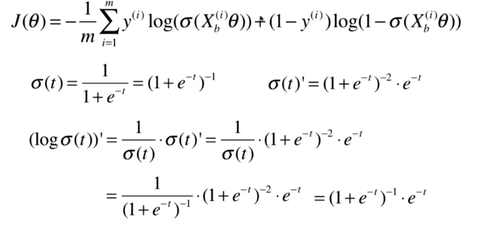
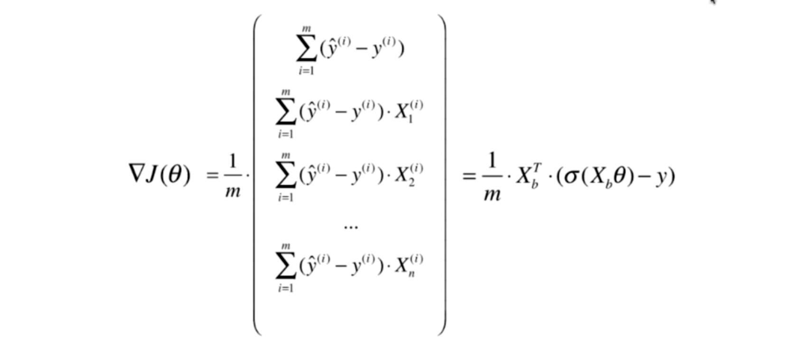

## 逻辑回归

逻辑回归是解决二分类问题的利器


回归问题怎么解决分类问题？

将样本的特征和样本发生的概率联系起来，概率是一个数。

```text
y^ = f(x)

p^ = f(x)

y^ = {
   1,   p^ >=0.5
   0,   p^ <0.5
}
```


### 应用场景
- 疾病是否是阳性
- 银行卡房贷款是否放贷
- 预测广告点击率（是否点击，是否推荐这个广告)
- 是否是垃圾邮件
- 推荐系统中用到很多二分类任务


### 极大似然估计

核心思想：

设模型中含有待估参数w，可以取很多值。已经知道了样本观测值，从w的一切可能值中（选出一个使该观察值出现的概率为最大的值，作为w参数的估计值，这就是极大似然估计。（顾名思义：就是看上去那个是最大可能的意思）


假设有一枚不均匀的硬币，出现正面的概率和反面的概率是不同的。假定出现正面的概率为𝜃， 抛了6次得到如下现象 D = {正面，反面，反面，正面，正面，正面}。每次投掷事件都是相互独立的。 则根据产生的现象D，来估计参数𝜃是多少?

```text
P(D|𝜃) = P {正面，反面，反面，正面，正面，正面}
 = P(正面|𝜃) P(正面|𝜃) P(正面|𝜃) P(正面|𝜃) P(正面|𝜃) P(正面|𝜃)

=𝜃 *(1-𝜃)*(1-𝜃)𝜃*𝜃*𝜃 = 𝜃^4(1 − 𝜃)^2

求此函数的极大值时，估计𝜃为多少
```
```text
对上面函数求导
4𝜃^3.(1-𝜃)^2+ 𝜃^4. 2(1-𝜃)*-1
= 4𝜃^3.(1-𝜃)^2 - 2𝜃^4(1-𝜃)

= 𝜃^3.(1-𝜃)( 4-4𝜃 ) - 𝜃^3.(1-𝜃)(2𝜃)
= 𝜃^3.(1-𝜃)(4-6𝜃 ) = 0 

𝜃1=0 ,𝜃2=1,𝜃3=2/3 
因为0，1不可能，所以𝜃 取2/3
```


```text
ln(1/a)=ln(a^-1)=-lna
ln(1/2π^(n/2)) = - ln 2π^(n/2) =-n/2 ln 2π
```

### 逻辑回归的原理


 基本思想

1. 利用线性模型 f(x) = wx + b 根据特征的重要性计算出一个值
2. 再使用 sigmoid 函数将 f(x) 的输出值映射为概率值
   1. 设置阈值(eg:0.5)，输出概率值大于 0.5，则将未知样本输出为 1 类
   2. 否则输出为 0 类

3. 逻辑回归的假设函数
   -  h(w) = sigmoid(wx + b )
   - 线性回归的输出，作为逻辑回归的输入


逻辑回归中，其输入值是什么
  - 逻辑回归的输入就是一个线性方程
  - h(w) = w1x1 + w2x2 + .... + b 

如何判断逻辑回归的输出
  - sigmoid函数
   

σ(t) = 1/(1+e^-t)


判断标准

回归的结果输入到sigmoid函数当中
输出结果：[0, 1]区间中的一个概率值，默认为0.5为阈值


sigmod函数可导，是单调递增函数。 

导函数公式： f'(x) = f(x) (1-f(x))

逻辑回归最终的分类是通过属于某个类别的概率值来判断是否属于某个类别，并且这个类别默认标记为1(正例),另外的一个类别会标记为0(反例)。（方便损失计算）


### 损失函数


```text
cost = {
    如果y=1, p 越小，cost越大，（y是真实值，p小代表估计错了)
    如果y=0,p越大,cost越大
}

cost = {
    -log(p^)   if y = 1
    -log(1-p^) if y=0
}

一个样本的损失：
cost = -ylog(p^) -(1-y) log(1-p^)
```


其损失函数通常是对数损失函数（log loss），也称为交叉熵损失函数（cross-entropy loss）。对于逻辑回归模型，损失函数的定义如下：


1. 一个样本
- 假设有2个类别，1的类别概率是p， 0的类别概率是1-p
```text
L = {
   p    if y = 1
   1-p  if y = 0
}
样本是1的概率是p,样本是0的概率是1-p

上面等价于这个公式
L = p^y . (1-p)^(1-y)
```

2. n个样本
```text
L = (p1^y1 . (1-p1)^(1-y1)) * (p2^y2 . (1-p2)^(1-y2)) * .... * (p2^yn . (1-p2)^(1-yn)) 
pi 为 每个样本 被分类正确时的概率
yi 为表示每个样本的真实类别
```

3. 对上面公式求对数转换公式


**让联合概率最大时，估计w,b的参数，就是极大拟然估计** 

最大化问题变成最小化


4. 使用梯度下降算法，更新逻辑回归算法的权重参数

没有公式解


这里省略n步，有点麻烦.... 



### 实现逻辑回归算法
```python
import numpy as np
from .metrics import accuracy_score

class LogisticRegression:

    def __init__(self):
        """初始化Logistic Regression模型"""
        self.coef_ = None
        self.intercept_ = None
        self._theta = None

    def _sigmoid(self, t):
        return 1. / (1. + np.exp(-t))

    def fit(self, X_train, y_train, eta=0.01, n_iters=1e4):
        """根据训练数据集X_train, y_train, 使用梯度下降法训练Logistic Regression模型"""
        assert X_train.shape[0] == y_train.shape[0], \
            "the size of X_train must be equal to the size of y_train"

        # 损失值
        def J(theta, X_b, y):
            y_hat = self._sigmoid(X_b.dot(theta))
            try:
                return - np.sum(y*np.log(y_hat) + (1-y)*np.log(1-y_hat)) / len(y)
            except:
                return float('inf')

        # 梯度
        def dJ(theta, X_b, y):
            return X_b.T.dot(self._sigmoid(X_b.dot(theta)) - y) / len(y)

        # 梯度下降法
        def gradient_descent(X_b, y, initial_theta, eta, n_iters=1e4, epsilon=1e-8):

            theta = initial_theta
            cur_iter = 0

            while cur_iter < n_iters:
                gradient = dJ(theta, X_b, y)
                last_theta = theta
                theta = theta - eta * gradient
                if (abs(J(theta, X_b, y) - J(last_theta, X_b, y)) < epsilon):
                    break

                cur_iter += 1

            return theta

        X_b = np.hstack([np.ones((len(X_train), 1)), X_train])
        initial_theta = np.zeros(X_b.shape[1])
        self._theta = gradient_descent(X_b, y_train, initial_theta, eta, n_iters)

        self.intercept_ = self._theta[0]
        self.coef_ = self._theta[1:]

        return self

    # sigmod 得出的概率
    def predict_proba(self, X_predict):
        """给定待预测数据集X_predict，返回表示X_predict的结果概率向量"""
        assert self.intercept_ is not None and self.coef_ is not None, \
            "must fit before predict!"
        assert X_predict.shape[1] == len(self.coef_), \
            "the feature number of X_predict must be equal to X_train"

        X_b = np.hstack([np.ones((len(X_predict), 1)), X_predict])
        return self._sigmoid(X_b.dot(self._theta))
    # 预测是0还是1 ，二分类
    def predict(self, X_predict):
        """给定待预测数据集X_predict，返回表示X_predict的结果向量"""
        assert self.intercept_ is not None and self.coef_ is not None, \
            "must fit before predict!"
        assert X_predict.shape[1] == len(self.coef_), \
            "the feature number of X_predict must be equal to X_train"

        proba = self.predict_proba(X_predict)
        # 这里先定死 0。5 就是1.
        return np.array(proba >= 0.5, dtype='int')

    def score(self, X_test, y_test):
        """根据测试数据集 X_test 和 y_test 确定当前模型的准确度"""

        y_predict = self.predict(X_test)
        # 这里是 准确率
        return accuracy_score(y_test, y_predict)

    def __repr__(self):
        return "LogisticRegression()"


```

### 决策边界

```text
σ(t) = 1/(1+e^-t)
```
决策边界就是 t=0, 也就是 `ΘT . X_b = 0`


如果x有2个特征
```text
 Θ0+ Θ1. X1 +Θ2. X2=0

X2 = (- Θ0-Θ1. X1) /Θ2
```

### 使用多项式特征

```python
from sklearn.preprocessing import PolynomialFeatures
```
### 使用正则化

之前正则化的函数是
```text
J(Θ) + αL2     
J(Θ) + αL1
```

在逻辑回归中 scikit-learn中使用的方式
 
```text
C.J(Θ) + L2     
C.J(Θ) + L1
```


```python
from sklearn.preprocessing import PolynomialFeatures
from sklearn.pipeline import Pipeline
from sklearn.preprocessing import StandardScaler
from sklearn.linear_model import LogisticRegression
# 模型正则化
def PolynomialLogisticRegression(degree, C,penalty='l2'):
    return Pipeline([
        ('poly', PolynomialFeatures(degree=degree)),
        ('std_scaler', StandardScaler()),
        ('log_reg', LogisticRegression(C=C,penalty=penalty))
    ])

# 这里c=0.1就是让 正则化的项（L2,L1 在损失函数中作用起到更大，默认c=1)
poly_log_reg3 = PolynomialLogisticRegression(degree=20, C=0.1)
# poly_log_reg3.fit(X_train, y_train)

```


### 解决多分类问题

#### OvR (One vs Rest )

一个比较其他所有剩下的
 
n个类别就进行n次分类，选择分类得分最高的。

#### OvO 

One vs One 

n个类别就进行C(n,2) 次分类，选择赢数最高的分类。 


