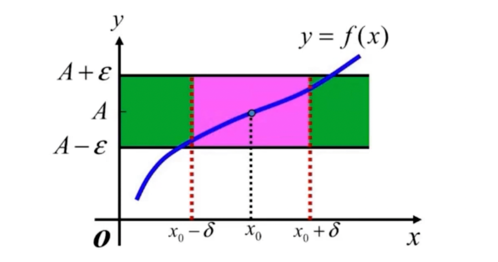
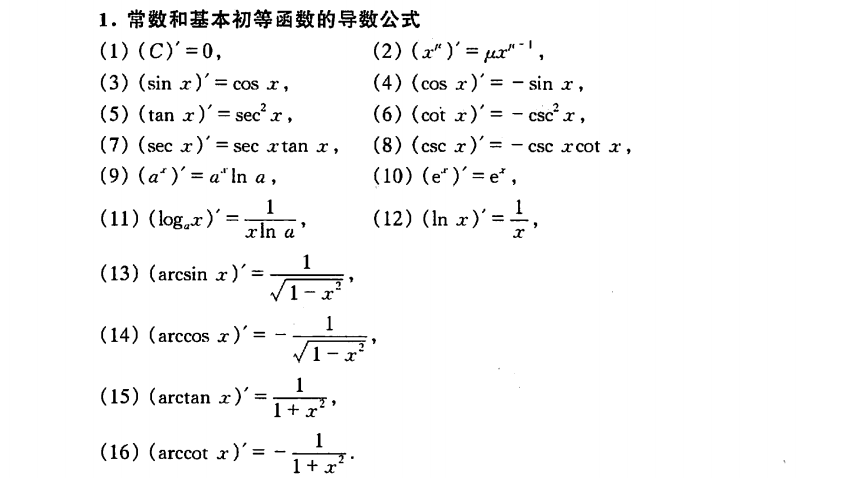
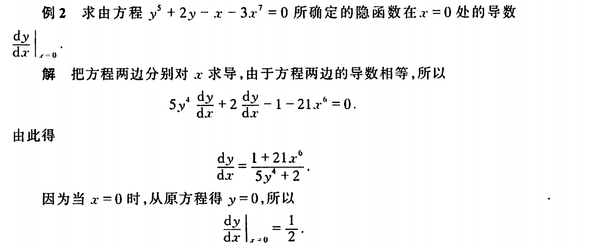
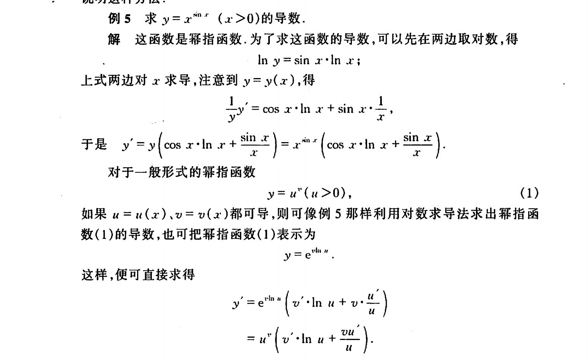
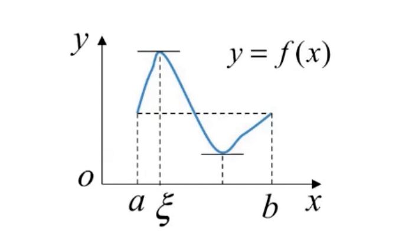
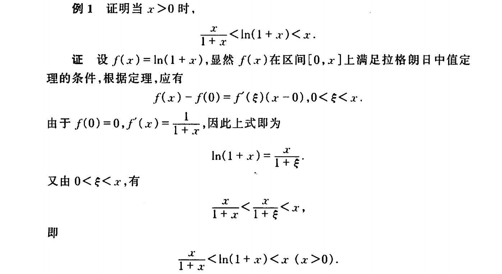
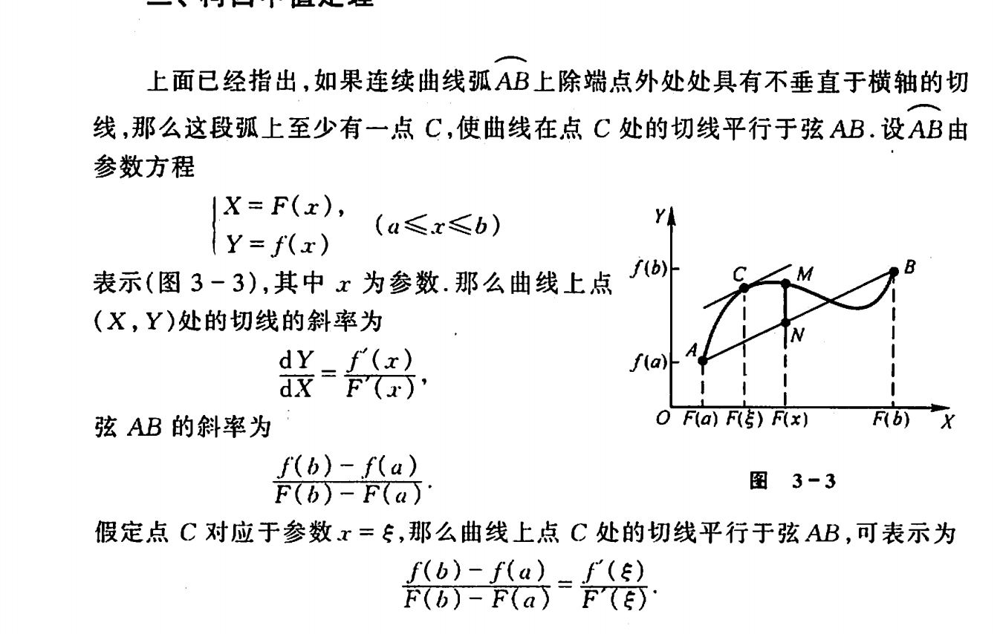

# 高等数学 

## 集合、映射和函数
### 集合

集合列子：
- 某特定时间上，某城市的树的种类

非集合例子
- 100个同批次同型号的乒乓球。 无法区别（元素互异性）

集合中的元素是坐标系中的点

- {(x,y)|x+y<3}

集合有包含关系。 子集： 所有元素都是 某集合。记作 A ∈ B

真子集（ 集合不相等)

####  数集分类

- N 自然数集 N={0,1,2,3,...,n...}
- Z 整数集合 Z ={...,-n,...,-2,-1,0,1,2,...,n,....}
- Q 有理数集合 
- R 实数集合 R = {x| x是有理数或无理数}

N ∈ Z, Z∈Q ,Q ∈ R

#### 全集和补集


在实数集R中，集合A={x|0<x<=1} 的余集（补集) 就是 A^c  = {x|x<=0或x>1}


#### 区间
{x|a<x<b},称为开区间，记作(a,b)

{x|a<=x<=b} ,成为闭区间，记作[a,b]

#### 领域

点a的领域记作  U(a)

设η是任一正数，则开区间(a-η,a+η) 就是a的一个领域，这个领域称为点a的η领域，记作U(a,η)

U(a,η) = {x|a-η <x < a+η}


### 映射

设A、B是两个非空集合，如果存在一个法则f:A->B，使得对于任意a∈A，都有f(a)∈B，则称f为A到B的映射。记作f:A→B。

b 称为元素a在映射 f 下的像, 记为 b = f(a)。

a 称为元素 b在映射 f 上的原像

集合A称为映射f的定义域，记作 D(f)

集合A中所有元素的像所组成的集合称为映射f的值域，记作 R(f)或者f(A)

- 映射三要素： 定义域，值域，对应法则
- 定义域 D(f) = A
- 值域 R(f) ∈ B
- 对于每个 a ∈ A ,元素 a 的像 b 唯一
- 对应每个b ∈ R(f) ,元素 b 的原像不一定唯一。


满射： Rf=Y

单射: ψ(任意符号)x,x2 ∈ X,x1!=x2,有f(x1) != f(x2) 

一一映射: 满射＋单射


逆映射

- 设f 是 A到B 的双射，那么存在一个映射 g:B→A，使得g(f(a))=a,g(b)=f(g(b))

对每个 b ∈ B ,规定g(b) = a, 这 a 满足f(a)=b

g 称为 f 的逆映射。记为 g=f-¹，定义域 D(g) = B, 值域 R(g) = A


 
### 函数

设数集D ∈ R ,则称映射f : D → R 为定义在 D上的函数。记为 y=f(x),x ∈ D，x 称为自变量，y 称为因变量， D称为定义域

#### 反函数

设映射 f： D->E为双射(D∈R,E∈R)

则它的逆映射 f-¹ : E->D称为 f 的反函数。

f(x)=x²

f-¹(x)=sqrt(x)

#### 函数的特性


函数单调性

函数奇偶性

奇函数： f(x)=-f(-x) ，图像关于原点对称

偶函数: f(x)=f(-x) ,图像关于 y 轴对称。

函数的周期性: x∈D，且(x+l)∈D ，f(x+l)=f(x) 恒成立，则f(x)为周期函数。如正弦、余弦函数,周期2π。


#### 基本初等函数

- 幂函数 y=x^n (n∈R ，常数)
- 指数函数 y=a^x (a>0，且 a!=1)
- 对数函数 y=log_a(x) (a>0，且 a!=1)
- 三角函数 y=sin(x) ,y=cos(x) ,y=tan(x)等
  - tan(x) =sin(x) / cos(x)
- 反三角函数 y=arcsin(x)、y=arccos(x)、y=arctan(x)等

一次函数

#### 二次函数

- y=ax²+bx+c
    - 对称轴: -b/2a
    - a > 0 开口向上 ,(-♾️,-b/2a) 单调递减. （-b/2a,+♾️) 单调递增 ,最小值 (4ac-b²)/4a
    - a < 0 开口向下 ,(-♾️,-b/2a) 单调递增. （-b/2a,+♾️) 单调递减 ,最大值 (4ac-b²)/4a

#### 二次函数简单应用实例

- 桥梁建筑设计
- 篮球、排球落点
- 经济学的投资分析，售价定价


- 某商品进价 80元，按 100元出售，一天可卖 60件，经时长调查，该商品每降价 1 元，销量增加 5 件，求该商品售价多少，利润最大。

设定 商品售价x,每天售出为60+5(100-x)

y= (x-80)*(60+5(100-x)) = -5x^2+960x-44800

当 x=96时，y 取得最大值。

#### 对数函数

y=log_a(x) (a >0, a!=1)

常用公式

log_a(x1)+log_a(x2) =log_a(x2*x1)      , log_2(4)+log_2(8) = log_2(32)=5

log_a(x1)-log_a(x2) =log_a(x1/x2), log_2(4) -log_2(8) = log_2(1/2) = -1

log_a^m (x^n) =n/m log_a(x)  , log_2^3(8^2) = 2/3 log_2(8)= 2

log_a(x) = log_b(x)/log_b(a)    ,log_32(64) = log_2(64) / log_2(32) = 6/5

#### 正弦函数

y=a*sin(ωx+φ)  a(a>0) 振幅，w 频率， φ初始相位

傅里叶级数

应用：通信、电子等和电有关的领域。

最小正周期 T = 2π/ω ,有界 y∈[-|a|,|a|]

对称轴处取得极值

wx+φ=π/2 +2kπ , 取得极大值，k ∈ Z

wx+φ=-π/2 +2kπ ,取得 极小值，k ∈ Z

#### 余弦函数

y=a * cos(wx+φ) , a(a>0) 振幅，w 频率， φ初始相位

物理应用领域。

最小正周期 T = 2π/ω ,有界 y∈[-|a|,|a|]

wx+φ=2kπ, 取得极大值，k ∈ Z

wx+φ=π+2kπ, 取得极小值，k ∈ Z 


#### 参数方程

x=2t 

y = 3t^2 ，去除参数 t

得到 y=3/4x^2,二者等价

 #### 极坐标系

x=rcosθ,

y=rsinθ

描述与角度有关的曲线会更简洁


## 数列极限

### 数列

将自然数按1,2,3...编号依次排列的一列数x1,x2,x3,...,xn称为无穷数列，简称数列。

xn称为通项，此数列可以记为:{xn}

例如2,4,8,16... 记为: {2^n}

- 如果对于任意给定的正数ε（不论有多么小），
- 总存在正整数N，
- 使得对于n > N时的一切xn,
- 不等式|xn-a| < ε都成立

那么就称常数a 是数列xn的极限，或者称数列xn收敛于a.

记为: 数列xn 当n接近无穷大时，数列的极限是a。
```text
lim xn=a (或 xn->a(n->∞))
n->∞   
```

如果数列没有极限，就说数列是发散的，否则是收敛的。

```text
lim xn=a     <=>    ∀ε > 0 ,∃ 正整数N，当n>N时，有|xn - a| < ε
n->∞   
```
-  ∀表示任意给定的或对于每一个
- ∃ 表示存在或至少有一个
- 数列极限的定义未给出求极限的方法


收敛数列的性质
- 有界性
- 唯一性，，每个收敛数列只有一个极限.

## 函数极限

函数的极限：在自变量的某个变化过程中，如果对应的函数值无限接近于某个确定的数，那么这个确定的数就叫做在一一变化过程中的函数的极限。

 - 如果对于任意给定的正数ε（不论有多么小），
- 总存在正数δ，使得对于合适不等式0<|x-x0|<δ的一切x
- 所对应的函数值f(x)都满足不等式|f(x)-A| <ε,
- 那么常数A就叫做函数f(x)当x->x0时的极限

```text
lim f(x)=A     <=>     f(x)->A(当x->x0)
x->x0   
```


```text
lim f(x)=A     <=>    ∀ε > 0 ,∃ δ>0，当0<|x-x0| < δ时，恒有|f(x)-A| < ε 
x->x0   
```


当x在x0的δ去心领域时，函数y=f(x)图形完全落在以直线y=A,带宽为2 ε 的区域内


- 函数极限与f(x)在x0是否有定义无关。(x0 是否在定义域内没有关系)
- δ与任意给定的正数ε相关
- 找到一个δ后，δ越小越好，它体现x与x0的接近程度。


### 单侧极限

左极限
```text
   ∀ε > 0 ,∃ δ>0，当x0-δ<x<x0 ,恒有|f(x)-A| < ε 
记作 lim     f(x) =A  <=> f(x0-0)=A
    x->x0-
```

右极限
```text
   ∀ε > 0 ,∃ δ>0，当x0<x<x0+δ ,恒有|f(x)-A| < ε 
记作 lim     f(x) =A  <=> f(x0+0)=A
    x->x0+
```


### 自变量无穷大函数的极限
ε-X语言：

 ```text
 lim f(x) =A     <=> ∀ε > 0 ,∃ X>0,使当|x|>X时，恒有|f(x)-A| < ε 
 x->∞
 ```
定理: 

```text
lim   f(x)=A <=>   lim    f(x)=A 且  lim    f(x)=A
x->∞               x->+∞             x->-∞  
```

### 函数极限的性质

- 唯一性
  ```text
  如果lim f(x)存在， 那么此极限唯一.
      x->x0
  ```
- 局部有界性

## 极值 

### 无穷小

**极限为0的变量称为无穷小**

无穷小量即以数0为极限的变量，无限接近于0。确切地说，当自变量x无限接近x0（或x的绝对值无限增大）时，函数值f(x)与0无限接近，即f(x)→0(或f(x)=0)，则称f(x)为当x→x0(或x→∞)时的无穷小量。

特别要指出的是，**切不可把很小的数与无穷小量混为一谈**。

**零时可以作为无穷小的唯一常数**


记作:
```text
lim f(x)=0 或 lim f(x) = 0
x->x0             x->∞

```

例：
```text
lim   sinx=0 函数sinx是当x->0时的无穷小
x->0 


lim    1/x =0   那么函数1/x 是当x->∞的无穷小
x->∞
```

#### 无穷小和函数极限的关系

定理1 
```text
lim    f(x) =A   <=>  f(x) = A+α(x),α(x)是当x->x0时的无穷小. 
x->x0
```
定理给出了函数f(x)在x0附近的近似表达式， f(x) ≈ A，误差为α(x)。


定理2： 有限个无穷小的和也是无穷小

定理3：有界函数与无穷小的乘积是无穷小
- 推理1 常数和无穷小的乘积是无穷小.
- 推理2 有限个无穷小的乘积也是无穷小. 


无穷小
```text
 因为  lim(x-2)=0 ,所以函数(x-2) 为 x->2的时的无穷小
       x->2

 因为  lim(x-2)^2=0 ,所以函数(x-2)^2 为 x->2的时的无穷小
       x->2
```

极限存在的充要条件
- 在自变量的同意变化中x->x0 或x->∞时，函数值f(x)具有极限 A的充要条件是f(x)=A+α,其中α是无穷小
- f(x)=1+1/x+2/x^2 =1+α(x)

```text
lim α(x) = lim(1/x+2/x^2) = 0 
x->∞       x->∞  

lim(1+ 1/x+2/x^2) = 1 
x->∞      
```

### 无穷大

- 如果对于任意给定的正数M（不论有多大）总存在正数δ（或正数X）,
- 使得对于合适不等式 0<|x-x0| <δ  (或|x|>X)的一切x，
- 所对应的函数值f(x) 都满足不等式|f(x)| > M 
- 那么称函数f(x) 当x->x0 (x->∞ ) 时为无穷大

记作：
```text
lim   f(x) = ∞ 或   lim   f(x)=∞ 
x->x0               x->∞ 
```

定理：
- 在自变量的同一变化过程中，如果 f(x)为无穷大，那么1/f(x) 为无穷小。
- 如果 f(x)为无穷小，且f(x) !=0 , 那么1/f(x) 为无穷大。

**关于无穷大的讨论，都可归结于关于无穷小的讨论。 **


```text
正无穷大 
lim    f(x) = ∞ 
x->x0

负无穷大
lim    f(x)= -∞ 
x->x0
```

- 无界变量未必是无穷大
- 不可将 无穷大认为是 极限存在。

        


### 极限

极限就是研究自变量无限接近一个数或其绝对值无限增大时，函数值是否会无限接近一个数

lim 就是极限

### 极限运算法则

- 有限个无穷小之和 仍然是无穷小
- 有限函数与无穷小的积仍然是无穷小
- 有限个无穷小之积仍然是无穷小
- 如果lim f(x)=A ,lim g(x) =B 
  - lim f(x) +- g(x) = A+-B
  - lim f(x) * g(x)  = A*B
  - lim f(x) / g(x)  = A/B ,其中B!=0
- 如果 lim g(x) 存在，c 为常数，则 lim[c g(x)] = c lim g(x)
- 如果 lim g(x)存在，n 为正整数，则 lim [g(x)]^n=[lim g(x)]^n
- 有数列{a_n},{b_n} 如果 lim a_n=A, lim b_n=B,  n->∞.
  - lim(a_n + b_n) = A+B 
  - lim(a_n * b_n ) =A*B
  - 当b_n!=0 (n=1,2,3....) 且 B!=0 时，lim (a_n/b_n) = A/B 


### 夹逼准则
```text
|x| > M 时，g(x) <= f(x) <= h(x)

lim g(x)=A  ,lim h(x) =A
x->x0         x->x0
(x->∞ )       (x->∞ )

那么函数f(x)的极限存在，则 

lim f(x)=A
x->x0
(x->∞)
```

### 柯西极限存在准则
数列{xn}收敛的充分必要条件：
对于任意给定的正数ε，存在着这样的正整数N，使得当m>N,n>N时就有
|xm-xn|<ε


### 极限存在准则

- 若数列{a_n} 、 {b_n}、{c_n} 满足从某项n_0开始起，当 n > n_0 时， a_n <= b_n <=c_n ,且 lim a_n = m ,lim c_n=m ,则{b_n}极限存在且 lim b_n = m
- 单调有界数列必有极限
- 两个重要结论

```text
lim(1+1/x)^x = e 
x->∞

lim(1+y)^(1/y) = e 
y->0


lim sin(x) /x  = 1
x->0
```

### 无穷小比较
- 若 lim b/a = 0 则 b 是比 a 高阶的无穷小，记为b=O(a)
- 若 lim b/a= ∞ 则 b 是比 a 低阶的无穷小
- 若 lim b/a=c, !=0 ,则 b 与 a 同阶无穷小
- 若lim b/a=1 ,则 b 与 a 等阶无穷小，记为a~b
- 若lim b/a^m = c ,!=0 ,m>0 ,则 b 是关于 a 的 m 阶无穷小。

log_a(e)= 1/ ln_a

常用结论
- log_a(1+x) ~  1/ln_a . x 
- ln(1+x) ~ x 
- a^x -1  ~ ln_a . x 
- e^x -1 ~x 
- (1+x)^a -1 ~ ax  

### 极限与函数连续性
- 某点处连续性判断，左极限=右极限=该点函数值
- 一切初等函数在其定义域区间内都是连续的

#### 增量

- 变量u, 初值u1->终值u2
- 增量△u :△u=u2-u1
- 正的增量△u：u1变u2时是增大的
- 负的增量△u：u1变u2时是减小的

#### 函数的增量
- 设函数f(x)在U（x0)内有定义
- ∀ x ∈ U（x0)，△x=x-x0称为自变量在点x0的增量
- △y=f(x0+△x)-f(x0)称为函数f(x)相应于△x的增量.


#### 连续的定义

- 设函数y=f(x)在点x0的某一领域内有定义
- 如果
```text
lim f(x)=f(x0)
x->x0
```
那么就称y=f(x)在点x0 连续


ε-δ语言：
- ∀ ε>0,∃δ>0,
- 当|x-x0|<δ时，
- 恒有|f(x)-f(x0)|<ε.


左连续、右连续。 


## 导数与微分


### 导数的定义
切线
y=f(x)=0.1x^2

割线斜率 = (f(x + h) - f(x)) / h 

切线斜率: 
```text
lim (f(x+h)-f(x))/h 
h->0
```


斜率绝对值越大，直线越陡峭

导数的定义


**导数概念就是函数变化率这一概念的精确描述**

```text
△y/△x : y在[x0,x0+△x ]的平均变化率

f'(x): y在x0点处的变化率

反应了因变量随着自变量的变化而变化的快慢程度
```


```text
导数  f'(x0) = lim (f(x0+h)-f(x0))/h , h->0  
所有点的导数构成导函数  f'(x) = lim (f(x+h)-f(x))/h , h->0  
导数是平均变化率的极限

y=f(x) 的导数可以记为y'、f'(x) 、dy/dx、 df(x)/dx
```

可导与连续，可导一定连续

```text
 f'(x0) = lim (f(x0+h)-f(x0))/h , h->0  
 (f(x0+h)-f(x0))/h  = f'(x0) +@(h)
f(x0+h)-f(x0)  = f'(x0)h+@(h)h 

lim |f(x0+h)-f(x0) |  = lim | f'(x0)h+@(h)h | =0       ,h->0
```


#### 导数充要条件：
```text
极限 lim   (f(x0+h)-f(x) ) / h   存在的充分必要条件：左右极限都存在且相等
     h->0
     
 左导数： f'_(x0)
 右导数:  f'+(x0)
 
 左导数=右导数
```

#### 切线方程与法线方程

- 切线方程： y-y0=f'(x0)*(x-x0)
- 法线方程： y-y0= (-1/f'(x0)) * (x-x0)
- 法线的斜率 = -1/ 切线的斜率


 #### 函数的可到性与连续性的关系

可导必连续

```text
lim   △y/△x = f'(x) 存在，因此必有△y/△x = f'(x)+α，其中 lim     α=0
△x->0                                                △x->0
                                            
                                            
  △y=f'(x)△x+ α△x   ,△x->0 , △y->0
  所有函数f=f(x)在点x连续                                
```

f(x)在点x可导，那么在x点必连续。

y=|x| ,在x=0处连续，但不可导。


### 常见函数的导数



### 导数四则元算


### 求导
导数求极值:
- 导数为 0 的时候是函数的极值点
- 求函数 y=x^2 -4x +5  的极小值

求导法:对x求导,另 y'=2x-4   =0   ；  x=2

y=1 就是极小值


### 高阶导数

变速直线运动 s=s(t)

速度v = ds/dt 或 v=s'

加速度 a=dv/dt = d (ds/dt)/dt   或 a=(s')'

s对t的二阶导数，记作 d^2 . s / dt^2 或  s''(t)


定义若函数y=f(x)的导数y'=f'(x) 可导，则称f'(x)的导数为f(x)的二阶导数，记作 y''  ， (y')'

y''',y(4),y(n)  n阶导数。


莱布尼茲公式
### 隐函数的导数



### 幂指函数求导法则

两边取对数(对数求导法)




### 参数方程所确定函数的导数
```text
{
    x=F(t)
    y= f(t)
}

dy/dx=f'(t)/F'(t)

```


## 微分中值定理
- 罗尔定理
- 拉格朗日中值定理
- 柯西中值定理

这3个定理，是层层递进的。

### 罗尔定理

- 在闭区间[a,b]上连续‌：确保函数在区间端点处也是连续的，没有间断。
- ‌在开区间(a,b)内可导‌：确保函数在该区间内可以进行求导运算。
- f(a)=f(b)‌：确保函数在区间的两端取值相同。


推出:  在(a,b)内至少存在一个点ε，f'(ε)=0

### 拉格朗日中值定理

如果函数f(x)满足：
- 在闭区间上[a,b]连续;
- 在开区间(a,b)上可导；
- 那么在开区间(a,b)内至少存在一点ξ使得f'(ξ)=(f(b)-f(a))/(b-a)。 


拉格朗日中值定理的有限增量形式： △y=f'(x0+Θ. △x) .△x (0<Θ<1)

函数的微分： dy=f'(x).△x , dy->△y(△x->0)


#### 拉格朗日中值定理应用




ln1=0 

### 柯西中值定理




### 偏导
多元函数求导， 把其他变量都看作常数 

z是关于x和y的函数记成z(x,y) , z=(x-2)^2+(y-3)^2

```text
δz/δx = 2(x-2).1=0,       x=2时可以在x方向求导极限值
δz/δy = 2(y-3).1=0,       y=3时可以在y方向求导极限值
```

```text
z=x^y
δz/δx = y.x^(y-1)
δz/δy = ln(x) . x^y
```

```text
z=e^(2x^2-3y)
δz/δx =e^(2x^2-3y).(2x^2-3y)'=e^(2x^2-3y).4x =  4x.e^(2x^2-3y)
δz/δy =e^(2x^2-3y).(2x^2-3y)'= -3e^(2x^2-3y)
```


## links

- 高等数学第６版 上下册


